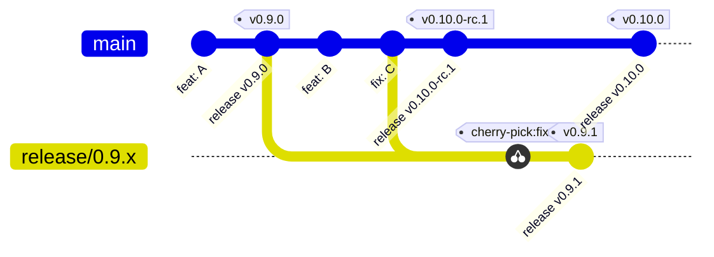
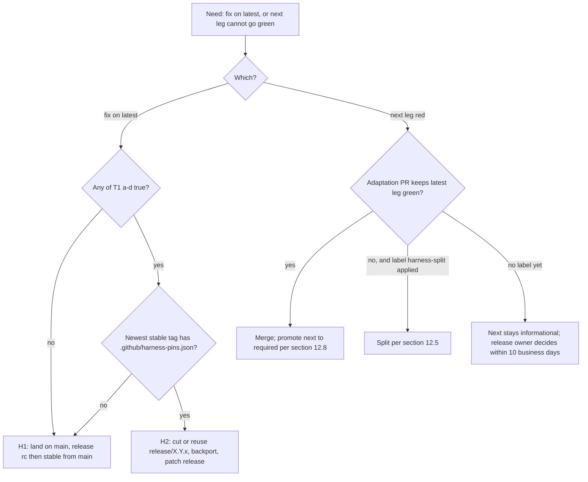

# Versioning, branching, and release management for dsh-cc

**Status:** **Proposed** — design only; this PR is docs-only. Implementation is split into PR-0 … PR-10 (§13). No workflow, script, manifest, tag, or npm dist-tag is changed by this document.
**Date:** 2026-09-25
**Branch:** `docs/versioning-release-plan` (based on `origin/main` eb6aeb9; citations re-verified at `origin/main` 043787a).
**Supersedes:** the harness-anchor policy of `docs/plans/2026-09-12-harness-0.1.5-rc1-compatibility.md` §1 ("anchor to the dsh meta-package `latest`" — now: anchor *each* dsh-cc channel to the same-named dsh channel) and the "Open-range policy" of `docs/plans/2026-09-08-harness-0.1.2-rc1-compat.md:363-370` (peer floors are now generated from pins, §10). `docs/release.md` remains the operator runbook; each implementation PR updates the sections it changes.
**Review log:** round 1 (2026-09-25, adversarial execution-readiness review): the PR-4…PR-8 window that would have blocked routine rc publishing at the `publish-plan` gate was closed by folding PR-8 into PR-4; `X.Y.Z(·)` notation, the raw-tuple reunification edge case, forward-only maintenance pins, the §9.3 promotion measurement, the R7 enumeration mechanism, PR-1/PR-2's `presubmit.yml` scope split, and execution-time version resolution were all pinned down. Decisions (2026-09-25): Q1 release owner = the GitHub user `jianxx` with no backup reviewer (single-owner bottleneck accepted); Q2 transition policy confirmed as written; Q3 promoted to a merge-blocking PR-2 acceptance criterion. Round 2 (2026-09-25, channel-pairing review): closed the split-mode gap where an upstream `latest` move was tracked by no branch (§11.2), split bump PRs per channel (§7.5), and added the `latest` catch-up deadline, the upstream-rollback runbook (§12.4 steps 5–6), the dsh-next-only feature rule (§7.3), and the transition wording (§5.2). PR #144 is closed, but its ladder defect is still on `main` (§13). Decisions D1–D5 are in §15.

All anchors below were verified against `origin/main` eb6aeb9 and re-verified at 043787a on 2026-09-25; no cited file changed between the two. Registry and upstream data were captured on 2026-09-25 at 20:09 SGT and re-checked unchanged at 23:40 SGT (Appendix B).

Normative words: **MUST**, **MUST NOT**, **SHOULD**, and **MAY** are used as in RFC 2119.

---

## 1. Summary

dsh-cc ships two npm channels (`latest` and `next`), but it verifies both of them against one harness build: `deepseek-harness` 0.1.5-rc.1. That build is neither of the versions users get from `@deepseek-ai/dsh` today (`latest` = 0.1.5-rc.3, `next` = 0.1.7-rc.2). This plan does four things:

1. **Pair the channels.** dsh-cc `latest` MUST be verified against dsh `latest`. dsh-cc `next` MUST be verified against dsh `next`; until the `next` leg is promoted to required (§9.3), that pairing is a preview (§5.2). The pairing is recorded in a new pins file, `.github/harness-pins.json` (§8), which becomes the single source of truth for CI, publish, peer ranges, and the launcher's version gate.
2. **Run CI against both pins.** CI runs one matrix leg per served channel (§9). Publishing is gated on the legs that are marked required. Moving pins is automated by a watcher that opens PRs; it never merges or publishes (§11).
3. **Keep one trunk until it can't serve both.** `main` serves both channels. A long-lived maintenance branch `release/X.Y.x` exists only for (a) an urgent hotfix to `latest`, or (b) a *harness split*: the two dsh lines become API-incompatible and no single commit can pass both legs. Exact triggers, procedures, and retirement rules are in §7.
4. **Make channel versions monotonic.** A new `next` MUST be greater than the current `next`, and a new `latest` MUST be greater than the current `latest`. This is enforced in the release-decision script, in `release.mjs`, and as a hard gate in `publish.yml` (§6.6). This also fixes the defect behind PR #144 (closed unmerged), which would have moved `next` backwards from 0.8.1-rc.1 to 0.8.0-rc.4. The ladder on `main` still proposes that version (§13).

## 2. Goals and non-goals

### Goals

- G-1. Every published dsh-cc version states which dsh version(s) it was verified against, and the dsh-cc channel it lands on matches the dsh channel it was verified against. **Transition exception:** until `next` is promoted to required (§9.3, R8), rc's on `next` are built and verified against dsh `latest`; each rc's Release notes state the dsh version it was actually verified against (§9.6), and the `next` ↔ `next` pairing is advertised only as a preview (§5.2).
- G-2. A developer can take any release situation (routine rc, stable, hotfix, upstream move, split, rollback) and execute it from §12 without further decisions.
- G-3. A dist-tag never moves backwards through an automated path.
- G-4. Every irreversible or user-visible action has an explicit human gate (§12.9).
- G-5. Upstream dist-tag moves are detected within 4 hours and turned into a reviewable PR.
- G-6. After upstream dsh `latest` moves, dsh-cc `latest` is either verified against the new version or publicly marked incompatible with it within 3 business days (§12.4 step 5).

### Non-goals

- Tracking the upstream `alpha` channel. dsh-cc publishes no `alpha` channel. Peer ranges do not admit dsh alphas (Appendix A).
- Reaching 1.0.0 or changing the major version. While dsh-cc is 0.x, breaking changes bump the minor version (§6.2).
- Versioning `@deepseek-ai/cordis` or `@deepseek-ai/schemastery` peers. They are versioned independently of dsh (cordis `latest` = 4.0.4), and the sync tooling MUST NOT touch them (§10.3).
- Making peer ranges enforce anything at install time. They are advisory (§4.1 F-6). The guarantees come from CI pins and the launcher floor.
- Replacing the daily RC ladder cadence. The weekly schedule, the SGT week, and the "one stable per week" rule stay as they are.

## 3. Glossary

| Term | Meaning in this document |
|---|---|
| **dsh / harness** | `@deepseek-ai/dsh`, the host CLI built from `deepseek-ai/deepseek-harness`. Its sub-packages (`@deepseek-ai/dsh-*`) are published in lockstep with the meta package (for example, `@deepseek-ai/dsh-agent@0.1.7-rc.2` exists). |
| **dsh-cc** | This repo. It publishes 85 non-private `@dsh-cc/*` packages. Users install `@dsh-cc/cli` (the launcher). |
| **dist-tag** | An npm pointer from a tag name to one version (`npm view <pkg> dist-tags`). |
| **channel** | A dist-tag that users install from: `latest` (the default for `npm i <pkg>`) or `next` (`npm i <pkg>@next`). |
| **pairing** | The rule that dsh-cc channel C is verified against dsh channel C. |
| **pin** | One entry in `.github/harness-pins.json`: a dsh version plus the exact commit SHA of its `dsh-v<version>` tag in the source repository. |
| **leg** | One CI matrix job that builds the harness at a pin and runs dsh-cc's harness-dependent gates. Leg names are `presubmit (latest)` and `presubmit (next)`. |
| **required / informational leg** | A required leg blocks merges (through the ruleset) and publishes (through `publish.yml`). An informational leg runs and is reported but blocks nothing. |
| **serves** | The set of channels a branch publishes to. It is declared in that branch's pins file. |
| **trunk mode** | `main` serves `["latest","next"]`. This is the default. |
| **split mode** | `main` serves `["next"]` and a maintenance branch serves `["latest"]` (§7.6). |
| **release line** | A bare `X.Y.Z` that rc's and a stable share, for example line `0.8.1` → `0.8.1-rc.1`, `0.8.1-rc.2`, `0.8.1`. |
| **lockstep** | All non-private packages and the root `package.json` carry the same version. This is enforced by `scripts/check-release-version.mjs`. |
| **release PR branch** | A short-lived `release/vX.Y.Z[-rc.N]` branch that carries only the version bump commit. |
| **maintenance branch** | A long-lived `release/X.Y.x` branch that publishes stable patch releases of line `X.Y` to `latest`. |
| **topic branch** | Any feature, fix, docs, or chore branch that targets `main` or a maintenance branch through a PR. |
| **effective next** | `max(upstream latest, upstream next)` by semver. If upstream `next` is older than upstream `latest`, or absent, `next` is treated as equal to `latest`. |
| **build channel** | The pin that the `publish` job itself builds and tests against (§9.5). |
| **release owner** | The person configured as the required reviewer of the `npm-publish` environment (PR-0 configures the GitHub user `jianxx`). This person makes every decision marked "release owner". |
| **business day** | Monday to Friday in Asia/Singapore. Time boxes in business days are counted from the creation time of the PR or event that starts them. |
| **fast-tracked stable** | A stable from `main` that the release owner dispatches with `-f fast_track=true` (§6.4) for one of three reasons: a *harness-latest* stable that carries a changed `pins.channels.latest` after upstream `latest` moved or rolled back (§12.4 steps 5–6), the pre-split stable (§12.5 S1), or the post-reunification stable (§12.6 step 4). It is exempt from V-9 and MAY follow its rc on the same day. |

## 4. Current state and gaps

### 4.1 Facts (verified)

| # | Fact | Evidence |
|---|---|---|
| F-1 | CI verifies against **one** harness commit, `1ef9c1fa…` ("0.1.5-rc.1 release commit"), checked out from the fork `dsh-cc/deepseek-harness`. `publish.yml` derives the same pin by grepping `presubmit.yml`. | `.github/workflows/presubmit.yml:47`, `:70-74`; `.github/workflows/publish.yml:72-78` |
| F-2 | The same pin was in force for v0.7.1, v0.8.0-rc.3, and v0.8.1-rc.1. | `gh api repos/dsh-cc/dsh-cc/contents/.github/workflows/presubmit.yml?ref=<tag>` |
| F-3 | The dist-tag is derived from the tag's shape only: prerelease → `next`, otherwise `latest`. | `publish.yml:181-186`, `:231`; `docs/release.md:69-73` |
| F-4 | Publish pipeline: `daily-release.yml` opens a `release/v*` PR on weekdays at 08:00 SGT. After a human merges it, `release-tag.yml` tags the merge commit and dispatches `publish.yml`, which publishes every non-private package. | `daily-release.yml:30`, `:165-199`; `release-tag.yml:33-37`, `:85`, `:146`; `publish-packages.mjs:94-101` |
| F-5 | 77 of 85 publishable packages declare `@deepseek-ai/dsh-*` as **peerDependencies**, all `>=0.1.5-rc.1` (368 occurrences). No package has a runtime `dependencies` entry on `@deepseek-ai/*`. devDependencies are `link:../../../../deepseek-harness/...`, and every one of the 1360 `@deepseek-ai` lockfile entries resolves to `link:`. | manifest scan; `pnpm-lock.yaml` |
| F-6 | Peers are advisory: profiles install with `autoInstallPeers: false` and resolve `@deepseek-ai/*` to the host dsh. | `docs/plans/2026-09-08-harness-0.1.2-rc1-compat.md:343-351` |
| F-7 | The launcher installs bundles at **its own exact version** (`@dsh-cc/bundle-*@<cli version>`). A dist-tag therefore only matters when users install `@dsh-cc/cli`. | `packages/launcher/tui/bootstrap.mjs:11-15`, `:142-145` |
| F-8 | The launcher floor is `MIN_DSH_VERSION = '0.1.5-rc.1'`. It is checked only on the bootstrap path, using a hand-rolled ordering that does **not** apply node-semver's prerelease rule, so 0.1.7-rc.2 and even `0.1.6-alpha.2` pass. | `bootstrap.mjs:518-527`, `:553-592`; `packages/launcher/tui/tests/version-gate.spec.ts:47-60` |
| F-9 | `check:publish` checks peer ranges against the sibling harness version. It rejects any range that contains whitespace, so `\|\|` ranges are unsupported. | `scripts/check-publish-manifests.mjs:15-19`, `:113-118`, `:182-190`, `:296-319` |
| F-10 | `/doctor` and `/version` display the harness version but do not judge it. | `packages/interaction/command-doctor/src/checks/env.ts:34-49` |
| F-11 | The published artifacts embed no harness code: type-only `@deepseek-ai/*` imports are erased. Which pin a build ran against affects verification only, not the bytes published. | `packages/interaction/command-permissions/tsdown.config.ts:5-11` |
| F-12 | The `main` ruleset ("PRs & conventional commits", id 22367074) has deletion, non-fast-forward, pull_request (0 approvals), and linear-history rules. It has **no required status checks**. | `gh api repos/dsh-cc/dsh-cc/rules/branches/main` |
| F-13 | The `npm-publish` environment has **no protection rules** and no deployment policy, even though `docs/release.md:132` says publishing needs human approval. | `gh api repos/dsh-cc/dsh-cc/environments` |
| F-14 | Release-tooling self-tests (`daily-release-decide.test.mjs`, `release.test.mjs`, `check-publish-manifests.test.mjs`) run neither in CI nor under vitest. | `presubmit.yml:122,213,217` (only three other `.test.mjs`); `vitest.config.ts:94` |

### 4.2 Gaps

- **G1 — No channel pairing.** Both channels are verified only against 0.1.5-rc.1. The dsh-cc@latest (0.7.1) + dsh@latest (0.1.5-rc.3) pairing has never been tested, and neither has the dsh-cc@next (0.8.1-rc.1) + dsh@next (0.1.7-rc.2) pairing.
- **G2 — Peer range rejects dsh next.** Under node-semver 7.8.5, `>=0.1.5-rc.1` does not admit `0.1.7-rc.2` (Appendix A). The range is advisory, but it misstates compatibility.
- **G3 — Monotonicity is not enforced.** `nextLineVersion` derives the line from the last stable only (`scripts/daily-release-decide.mjs:179`) and discards an rc on any other line (`:181-185`). v0.8.1-rc.1 exists on line 0.8.1, but the ladder computed line 0.8.0 and opened PR #144 ("chore(release): v0.8.0-rc.4"). Merging it would publish 0.8.0-rc.4 with `--tag next` and move `next` backwards. Nothing in `publish.yml` would stop it.
- **G4 — Fork without tags.** `dsh-cc/deepseek-harness` has one ref (`master` = `ddefc45`, the upstream `dsh-v0.1.6-alpha.2` commit, last pushed 2026-09-18) and no tags. Upstream `deepseek-ai/deepseek-harness` is public and carries every `dsh-v*` tag.
- **G5 — Bot PRs get no CI.** PRs opened with `GITHUB_TOKEN` trigger no workflows. PR #144 reports "no checks". PR #134 got `presubmit` only because a human pushed to it.
- **G6 — Publishing is not human-gated** (F-13), and merges are not check-gated (F-12).
- **G7 — The version is taken from the branch name.** `release-tag.yml:85` derives the tag from the head branch name. PR #134 (branch `release/v0.8.0-rc.4`) was re-versioned to 0.8.1-rc.1, so the Release Tag run failed and the tag was pushed by hand (inferred from the run history: Release Tag failed at 2026-09-24 14:06 SGT, and Publish v0.8.1-rc.1 started from a tag push 4 s later).
- **G8 — dsh next is structurally incompatible with the current tree.** At `dsh-v0.1.7-rc.2`, three harness packages that dsh-cc links no longer exist: `packages/code-runtime/code-runtime` (`@deepseek-ai/dsh-code-runtime`), `packages/preset/agent-presets` (`@deepseek-ai/dsh-agent-presets`), and `packages/workflow/workflow-worker-thread` (`@deepseek-ai/dsh-workflow-worker-thread`). All three were last published at 0.1.5-rc.3 on `next`. They are used by `packages/core/tools`, `packages/core/tool-workflow`, `packages/subagent/workflow-journal`, and `packages/ui/tui`. All 67 link targets exist at `dsh-v0.1.5-rc.3`. (Checked with the GitHub trees API for both SHAs, `truncated=false`.)

## 5. Channel model

### 5.1 Pairing rules

- R-1. dsh-cc `latest` ↔ dsh `latest`. A version published to dsh-cc `latest` MUST have passed a required leg at `pins.channels.latest` on the branch it was released from.
- R-2. dsh-cc `next` ↔ dsh `next` (effective next). A version published to dsh-cc `next` MUST have run the `next` leg. Once `next` is promoted to required (§9.3), that leg MUST have passed. Before promotion the leg is informational: its result, pass or fail, MUST be stated in the GitHub Release notes (§9.6), and the pairing is advertised only as a preview (§5.2).
- R-3. **A prerelease never takes `latest`.** This is unchanged (`docs/release.md:69-73`). It applies even though upstream's own `latest` is currently a prerelease (0.1.5-rc.3): dsh-cc pairs a *stable* dsh-cc with whatever dsh `latest` is.
- R-4. The upstream `alpha` channel is not tracked.
- R-5. After a stable release from a branch that serves both channels, `next` MUST NOT point below `latest`. `publish.yml` advances `next` to the stable version when `next` < stable (§9.5).
- R-6. dsh-cc and dsh version numbers are independent. The pairing is by channel name, never by number.

### 5.2 What users get

Users install both CLIs globally. The launcher pins bundles to its own version (F-7).

| Command | Today (2026-09-25) | Target, trunk mode | Target, split mode |
|---|---|---|---|
| `npm i -g @dsh-cc/cli` | 0.7.1, verified against dsh **0.1.5-rc.1** (not against dsh `latest` 0.1.5-rc.3) | Newest stable from `main`, verified against `pins.latest` (required) and `pins.next` (required after promotion, informational before) | Newest stable from `release/X.Y.x`, verified against that branch's `pins.latest` |
| `npm i -g @dsh-cc/cli@next` | 0.8.1-rc.1, verified against dsh **0.1.5-rc.1** (never against dsh `next` 0.1.7-rc.2) | After R8 promotion: newest rc from `main`, or the newest stable if that is higher (R-5), verified against both pins (both required) | Newest rc from `main`, verified against `main`'s `pins.next` only |
| `npm i -g @dsh-cc/cli@next` during the **transition** (trunk mode, until R8 promotion) | — | Newest rc from `main` (or a higher stable, R-5), built and verified against `pins.latest`; the `pins.next` leg runs and its result is reported but not required. Advertised as "preview, not verified with dsh next" | — (split mode always requires `next`) |
| `npm i -g @deepseek-ai/dsh` / `@next` | 0.1.5-rc.3 / 0.1.7-rc.2 | unchanged (upstream) | unchanged (upstream) |

The supported install commands are exactly these two pairs:

```sh
npm install -g @deepseek-ai/dsh @dsh-cc/cli            # latest ↔ latest
npm install -g @deepseek-ai/dsh@next @dsh-cc/cli@next  # next ↔ next
```

Mixed pairs are unsupported. The launcher still enforces only the floor (§10.4). The optional `/doctor` warning (§10.6) flags mixed pairs.

During the transition, the second pair MUST be described as "preview, not verified with dsh next" wherever it is advertised (README, GitHub Release notes, `/doctor`); the README states it as a supported pair only after R8 (§12.8). In that period the launcher's advice to install dsh `latest` (`DSH_CHANNEL = latest`, §10.1) names the pairing that was actually verified, so it is correct as is.

## 6. Versioning rules

### 6.1 Semver and lockstep

- V-1. Versions are SemVer 2.0: `X.Y.Z` or `X.Y.Z-rc.N` (N ≥ 1). dsh-cc publishes no other prerelease identifiers.
- V-2. Every release writes the same version to the root `package.json`, every non-private `packages/<group>/<pkg>/package.json`, every `.claude-plugin/plugin.json` of a non-private package, and `FALLBACK_VERSION` in `packages/interaction/command-version/src/version.ts:14`. Only `scripts/release.mjs` performs these writes. A human MUST NOT edit a version by hand, including on a `release/v*` branch (G7).
- V-3. Internal dependencies stay `workspace:^`, which publishes as `^<version>`. On 0.x a caret locks the minor (`^0.8.1-rc.1` = `>=0.8.1-rc.1 <0.9.0-0`), so a maintenance line never resolves another line's packages. §14 records the risk once 1.0 exists.

### 6.2 Choosing the release line on `main`

The ladder computes `line` as the maximum, by `X.Y.Z` comparison, of three candidates:

1. `base` = `nextLineVersion(lastStable, bump, hasFeat)`, unchanged (`daily-release-decide.mjs:111-126`). `bump=auto` gives a minor bump if any commit subject on `main` since `lastStable` matches `^feat(?:\(|!|:)` (`:281`), and a patch bump otherwise. A workflow dispatch MAY force `patch` or `minor`.
2. `openRcLine` = the line of the highest `vX.Y.Z-rc.N` tag merged into `main` whose `X.Y.Z` is greater than `lastStable`. This is the #144 fix. Today it yields 0.8.1.
3. `maintFloor` = `X.(Y+1).0` of `lastStable`, but only if (a) the remote has a branch `release/X.Y.x` for `lastStable`'s `X.Y`, or (b) `main`'s pins file does not serve `latest`. This keeps `main` off a line that a maintenance branch owns.

Breaking changes (`feat!`, `BREAKING CHANGE:`) bump the minor version while dsh-cc is 0.x.

### 6.3 Release candidates

- V-4. The first rc on a line is `-rc.1`. Each later rc on that line is the highest existing `-rc.N` plus 1. Rc numbers are never reused. Gaps are allowed (a tag that exists but was never published still consumes its number).
- V-5. The ladder proposes the next rc when `main` has commits after the latest rc on the line (`rc_bump`), or `-rc.1` when the line has no rc yet (`first_rc`).
- V-6. Rc's are published only from `main`. Maintenance branches never publish rc's (§7.6.4).

### 6.4 Stable releases

- V-7. A stable `X.Y.Z` is proposed when the latest rc on line `X.Y.Z` has no commits after it (`stabilize`). The stable's published content is identical to that rc except for the version fields.
  - Commits whose diff touches only `.github/harness-pins.json` and `pnpm-workspace.yaml` do not count as commits after the rc. Such a commit changes neither the published bytes nor a peer range: any pin change that alters a peer range or `MIN_DSH_VERSION` also rewrites manifests or `bootstrap.mjs` (§10.3) and therefore counts.
  - A fast-tracked stable (§3) MAY be proposed on the same day as its rc: once the rc is published, the release owner dispatches the ladder again with `-f fast_track=true`.
- V-8. Stable releases from `main` are allowed only when `main` serves `latest`. In split mode the ladder MUST NOT propose `stabilize`. It returns `action=skip reason=split_no_stabilize` when there is nothing new to rc.
- V-9. At most one stable from `main` per Asia/Singapore Mon–Sun week (unchanged). Maintenance tags do not count, because the ladder lists only tags merged into `main` (`daily-release-decide.mjs:212-219`). Fast-tracked stables are exempt: `daily-release.yml` gains a boolean dispatch input `fast_track` (default `false`) that skips the week check, and the release PR body names the fast-track reason (§3). The schedule never sets it.

### 6.5 Maintenance releases

- V-10. On `release/X.Y.x` the only allowed version is `X.Y.P` where P is one more than the highest patch number among all existing `vX.Y.P` and `vX.Y.P-rc.N` tags. Counting rc tags keeps a maintenance stable from reusing a line on which `main` already published an rc with different content. Maintenance releases are stable-only and go to `latest`.

### 6.6 Monotonicity

**Invariant M.** Let `cur(C)` be the current `@dsh-cc/cli` dist-tag of channel C. A publish of version V to C MUST satisfy `V ≥ cur(C)` (equality is a rerun), and V MUST be a stable version when C = `latest`. The only exception is the rollback runbook (§12.7), which uses `--allow-downgrade` behind the `npm-publish` approval.

Enforcement, in order of execution:

1. **`scripts/daily-release-decide.mjs` (proposal time).**
   - Add `openRcLine` and `maintFloor` to the line computation (§6.2).
   - Move `highestRcOnLine` into the pure `decide()` so that it runs on the final `line`.
   - Add the split-mode rule (V-8), the `fast_track` input (V-9), and the pins-only commit filter (V-7).
   - After computing `version`, assert that it is greater than every tag in `input.tags` of the same kind: rc vs. all rc tags, stable vs. all stable tags. If it is not, throw `monotonic_violation: <version> <= <tag>`, which fails the job loudly.
   - New `gatherInputFromGit` inputs: `maintenanceBranches` (from `git ls-remote --heads origin 'refs/heads/release/*.x'`) and `servesLatest` (from `.github/harness-pins.json`).
2. **New `scripts/check-channel-monotonic.mjs <tag|version> [--channel latest|next] [--package @dsh-cc/cli] [--allow-downgrade]`.**
   - It runs `npm view <package> dist-tags --json`.
   - The channel defaults from the version shape (prerelease → `next`).
   - Exit codes: 0 when V ≥ current or the tag is absent; 1 on a violation, or when a prerelease targets `latest`; 2 on a registry error (callers fail closed).
   - It compares with the exported `compareVersions` from `scripts/check-publish-manifests.mjs:74-97`.
   - It reads `@dsh-cc/cli` only. Per-package tag drift after a partial publish is repaired by the rerun re-tagging of §9.5.
3. **`scripts/release.mjs` (local and daily-release).** Before writing anything, it runs step 2 for the target version. A `--offline` flag skips this with a printed warning, for tests only.
4. **`publish.yml` `plan` job (hard gate).** Runs step 2 against the tag before any publish (§9.5).

Worked example (today's state):

- Inputs: `lastStable=v0.7.1`, feats present, highest rc above stable is `v0.8.1-rc.1`, and `main` has commits after it.
- `base=0.8.0`, `openRcLine=0.8.1`, so `line=0.8.1`.
- Proposal: `0.8.1-rc.2`, not `0.8.0-rc.4`.

## 7. Branching model

### 7.1 Branch types

| Pattern | Kind | Lifetime | Created by | Merges into | Protected |
|---|---|---|---|---|---|
| `main` | trunk | permanent | — | — | yes (§7.7) |
| `<type>/<slug>` or `worktree-<slug>` | topic | until merged | any developer | `main` or `release/X.Y.x` | no |
| `release/vX.Y.Z[-rc.N]` | release PR branch | until merged/closed | `daily-release.yml` (bot) or a human following §12.3 | `main` (rc/stable) or `release/X.Y.x` (patch) | no |
| `harness-bump/<base-slug>-<kind>` | bot branch | until merged/closed | `harness-watch.yml` | the base it names | no |
| `release/X.Y.x` | maintenance | until retired (§7.6.6) | release owner only | — | yes |

`<type>` is one of `feat`, `fix`, `docs`, `chore`, `refactor`, `perf`, `test`, `ci`, `build`. `<base-slug>` is the base branch with `/` replaced by `-` (`main`, `release-0.8.x`). `<kind>` is `latest`, `next`, or `reunify` (§11.2), for example `harness-bump/main-latest`. The prefixes `release/` and `harness-bump/` are reserved: humans MUST NOT create branches under them except as §12 prescribes. The two `release/` forms can't collide: a release PR branch always starts with `release/v`, and a maintenance branch always ends with `.x`.

### 7.2 `main`

- It is the only branch that develops features and the only source of rc's.
- It is always releasable to every channel it serves. The required legs MUST be green on every merge commit (the ruleset enforces this after PR-2, §7.7).
- In trunk mode it serves `["latest","next"]`. In split mode it serves `["next"]` (§7.6).
- It is changed only through PRs. Merges are squash or rebase (linear history, F-12).

### 7.3 Topic branches and PR conventions

- A PR title MUST be a valid Conventional Commit header (`type(scope)!: subject`). Squash merges use it as the commit subject, and the ladder reads subjects to choose minor vs. patch (§6.2). A user-visible capability MUST use `feat`; a bug fix MUST use `fix`.
- Topic branches SHOULD be rebased on their base before merge. The ruleset does not require branches to be up to date (§7.7), so a stale-but-green PR may merge; the post-merge `push` run on the base is the backstop.
- Fixes MUST land on `main` first ("main-first"). The only exception is a bug that does not exist on `main`: the fix then targets the maintenance branch directly, and the PR description MUST say why.
- **Features that need a dsh API present only at `pins.next`.** In trunk mode the same build goes to `latest`, so such a PR MUST keep `presubmit (latest)` green: detect the capability at runtime or import the module optionally, with local type shims so that typecheck passes at `pins.latest`. If that is not possible, the PR waits on its topic branch until upstream `latest` has the API. Such a PR is **not** a T2 trigger (§7.6.1) and MUST NOT receive the `harness-split` label.

### 7.4 Release PR branches (`release/v*`)

- Created by `daily-release.yml` (§12.1). This is unchanged, except that after PR-3 it dispatches `presubmit.yml` on the branch (G5) and runs `check-channel-monotonic.mjs` before opening the PR.
- They contain exactly one commit, `chore(release): vX.Y.Z[-rc.N]`, produced by `release.mjs`.
- The version in the branch name MUST equal the version in the commit (V-2, G7). To release a different version, close the PR and produce a new one. Never edit it.
- On merge, `release-tag.yml` tags the merge commit with the branch-derived tag and dispatches `publish.yml` with `--ref <base branch>` (§9.7).

### 7.5 Bot branches (`harness-bump/*`)

These are owned by `harness-watch.yml` (§11). There is at most one per base and kind: `-latest` changes only `channels.latest` (plus `channels.next` when validation rule 6 requires it, §11.2), `-next` changes only `channels.next`, and `-reunify` carries a reunification (§12.6). Keeping the channels on separate branches means a red `next` move never holds back a `latest` move. Humans MAY push adaptation commits to them. Once a human commit is present, the watcher stops force-pushing that branch only; the other kinds keep updating.

### 7.6 Maintenance branches (`release/X.Y.x`)

#### 7.6.1 When a maintenance branch is created

No maintenance branch exists by default. The release owner creates one when, and only when, one of these triggers holds.

**T1 — hotfix to `latest`.** A fix must reach `latest` users, and path H1 (release it from `main`, §12.3) is unavailable because at least one of these is true:
- (a) a stable from `main` was already published this SGT week;
- (b) `main` has unreleased `feat` commits since the last stable that the release owner does not want on `latest` yet;
- (c) a required leg is red on `main`;
- (d) the release owner requires the fix on `latest` within 24 hours.

**T2 — harness split.** A PR that is necessary to make `presubmit (next)` green on `main` makes `presubmit (latest)` red, and it cannot be restructured to keep both green. The typical cause is a harness package that dsh-cc must import existing at only one pin (G8). The PR author states this in the PR description, with links to both leg results. The release owner confirms by applying the label `harness-split` to that PR. **No split happens without that label.** T2 is also started by §12.4 step 5(b), where the label goes on the `harness-bump/main-latest` PR. A feature that needs a dsh-next-only API is never a T2 trigger (§7.3).

**Precondition for both triggers:** the maintenance branch is cut from the newest stable tag that contains `.github/harness-pins.json`, meaning a stable released after PR-4. Older tags (including v0.7.1) predate the channel-aware tooling. For them, a hotfix MUST use H1.

#### 7.6.2 Creation procedure (release owner)

Let `vX.Y.Z` be the newest stable tag on `main`. For T2, first complete step S1 of §12.5, which produces a fresh stable.

```sh
git fetch origin --tags
git push origin "vX.Y.Z^{commit}:refs/heads/release/X.Y.x"
```

Then open a PR against `release/X.Y.x` from a branch `chore/X.Y.x-serve-latest`:

```sh
git switch -c chore/X.Y.x-serve-latest origin/release/X.Y.x
node scripts/harness-pins.mjs set-serves latest   # serves ["latest"], required ["latest"], drops channels.next
node scripts/harness-pins.mjs sync
git commit -am "chore(release): X.Y.x serves latest only"
git push -u origin chore/X.Y.x-serve-latest
gh pr create --base release/X.Y.x --title "chore(release): X.Y.x serves latest only" --body "Maintenance bootstrap per docs/plans/2026-09-25-versioning-and-release-management.md §7.6.2"
```

The branch is in service once this PR merges.

#### 7.6.3 What may land on a maintenance branch

**Allowed:**
- `fix:` commits: backports (§7.6.5) and maintenance-only fixes (§7.3).
- `chore(harness):` pin bumps of `latest` that stay on the branch's dsh release line (§11.2), and a lowering bump after an upstream rollback (§12.4 step 6).
- Only as the cross-line fallback of §11.2 (a reunification probe failed its time box, §12.4 step 4) or in a split started by §12.4 step 5(b): a cross-line `latest` pin bump (on the watcher's `harness-bump/<base-slug>-latest`, or on a `fix/X.Y.x-dsh-<version>` branch in the step 5(b) case), plus `fix(harness):` adaptation commits on that PR, time-boxed to 2 business days.
- `ci:` and `chore:` backports of release tooling, needed only to keep the branch releasable.
- Release PRs `release/vX.Y.P` (V-10).

**Forbidden:** `feat:` commits, refactors, dependency upgrades other than security fixes, and any hand edit of versions.

#### 7.6.4 Releasing from a maintenance branch (patch to `latest`)

Maintenance releases are manual. `daily-release.yml` runs on `main` only. See §12.3, path H2, for the exact commands.

#### 7.6.5 Backport procedure

```sh
git fetch origin
git switch -c fix/X.Y.x-<slug> origin/release/X.Y.x
git cherry-pick -x <sha-on-main>          # one commit per original PR; resolve conflicts by hand
git push -u origin fix/X.Y.x-<slug>
gh pr create --base release/X.Y.x \
  --title "fix(<scope>): <subject> [backport X.Y.x]" \
  --body "Backport of #<PR> (<sha-on-main>)."
```

The `-x` trailer is mandatory: it records provenance for the release notes. A backport PR MUST pass `presubmit (latest)` on the maintenance branch.

#### 7.6.6 Retirement

A maintenance branch is retired when a stable from `main` whose line is higher takes `latest`. This happens after reunification (§12.6) or after an H1 release following a T1 branch. Procedure:

1. The release owner adds the branch to the ruleset "Retired maintenance branches" (update-restricted, §7.7). It is kept, not deleted; tags preserve its history either way.
2. `harness-watch.yml` ignores retired branches. It lists only `release/*.x` branches whose `.github/harness-pins.json` serves `latest` and whose name is not in `.github/retired-branches.txt`, a one-name-per-line file maintained on `main` in the same PR as step 1.

At most one maintenance branch is in service at any time. If a second trigger fires while one is active, it reuses the active branch when the lines match. Otherwise the release owner MUST retire the old branch first.

#### 7.6.7 Diagrams

The branch lifecycle in trunk mode, with a T1 hotfix branch (versions are illustrative):



`v0.9.1` goes to `latest`. `v0.10.0-rc.1` goes to `next`. When `v0.10.0` takes `latest`, `release/0.9.x` is retired.

How to choose the path when a fix must reach `latest`, or when the `next` leg can't go green:



### 7.7 Branch protection (release owner applies; repository admin rights needed)

| Target | Ruleset | Rules | Required status checks |
|---|---|---|---|
| `main` (`~DEFAULT_BRANCH`) | existing "PRs & conventional commits" (22367074) | keep deletion, non_fast_forward, pull_request (0 approvals), required_linear_history; **add** required_status_checks with "require branches to be up to date" **off** | trunk, before promotion: `presubmit (latest)`. After promotion: `presubmit (latest)`, `presubmit (next)`. Split: `presubmit (next)` |
| `release/*.x` | **new** "Maintenance branches", include `refs/heads/release/*.x` | creation (repository-admin bypass only), deletion, non_fast_forward, pull_request (0 approvals), required_linear_history, required_status_checks | `presubmit (latest)` |
| retired `release/X.Y.x` | **new** "Retired maintenance branches", include each retired branch by name | update (restrict updates), deletion | — |
| `release/v*`, `harness-bump/*`, topic branches | none | — | — (bots force-push the first two) |

The required-check set on `main` MUST change **before** merging a PR that changes `main`'s served channels. Otherwise the PR waits forever for a check that its own matrix no longer produces (§12.5 S4).

## 8. Harness pins

### 8.1 Source repository (decision)

CI checks out **upstream `deepseek-ai/deepseek-harness`** at a pinned SHA. It stops using the fork.

- Upstream is public and carries every `dsh-v*` tag. The fork has no tags and lags upstream (G4).
- Pinning by full SHA makes the checkout content-addressed, so upstream force-pushes cannot change what is tested.
- The fork is a manual-sync liability (`presubmit.yml:28-34` notes that deleting, privatizing, or GC'ing it breaks CI).
- **Fallback:** if upstream becomes unavailable, change `sourceRepository` to `dsh-cc/deepseek-harness` after pushing the needed tags there (`git push <fork> refs/tags/dsh-v<ver>`). It is a one-field change.

### 8.2 Schema: `.github/harness-pins.json`

Initial content after PR-1, with no behavior change. It uses the upstream tag commit of 0.1.5-rc.1. That commit is tree-identical to today's `1ef9c1fa`: GitHub compare reports it one commit ahead with zero changed files.

```json
{
  "schemaVersion": 1,
  "npmPackage": "@deepseek-ai/dsh",
  "sourceRepository": "deepseek-ai/deepseek-harness",
  "tagPrefix": "dsh-v",
  "serves": ["latest"],
  "required": ["latest"],
  "channels": {
    "latest": { "version": "0.1.5-rc.1", "sha": "183f08e9c6dde7e36cd2318eaee70b0da08fb35e" }
  }
}
```

Content after PR-4 (adds `next` as informational, pinned at the then-current effective next) and PR-6 (bumps `latest` to 0.1.5-rc.3):

```json
{
  "schemaVersion": 1,
  "npmPackage": "@deepseek-ai/dsh",
  "sourceRepository": "deepseek-ai/deepseek-harness",
  "tagPrefix": "dsh-v",
  "serves": ["latest", "next"],
  "required": ["latest"],
  "channels": {
    "latest": { "version": "0.1.5-rc.3", "sha": "a4c74a91e06b00fe0b0937bde982170c526cc842" },
    "next":   { "version": "0.1.7-rc.2", "sha": "477b4f420553e8a52c2fbccc464d7561b239c443" }
  }
}
```

| Field | Meaning |
|---|---|
| `schemaVersion` | Always `1`. |
| `npmPackage` | The upstream meta package whose dist-tags are tracked. Always `@deepseek-ai/dsh`. |
| `sourceRepository` | `owner/repo` checked out by CI. |
| `tagPrefix` | Upstream tag = `tagPrefix + version`. Always `dsh-v`. |
| `serves` | Channels this branch publishes to. |
| `required` | Channels whose legs block merges (via the ruleset) and publishes (via `publish.yml`). They also define the peer range and the launcher floor (§10). |
| `channels.<c>.version` | The dsh version of the pin. It MUST equal upstream `npm view @deepseek-ai/dsh dist-tags.<c>` (effective next for `next`) whenever the watcher has no pending PR. |
| `channels.<c>.sha` | The full 40-hex commit that `refs/tags/dsh-v<version>` resolves to (peeled if the tag is annotated). |

### 8.3 Validation (`node scripts/harness-pins.mjs validate`, offline; runs in presubmit, pre-commit, and publish)

1. `schemaVersion === 1`, `npmPackage === "@deepseek-ai/dsh"`, `tagPrefix === "dsh-v"`, and `sourceRepository` matches `^[A-Za-z0-9_.-]+/[A-Za-z0-9_.-]+$`.
2. `serves` is exactly one of `["latest","next"]`, `["latest"]`, or `["next"]`.
3. The keys of `channels` equal the set in `serves`.
4. Every `version` matches `^\d+\.\d+\.\d+(-rc\.\d+)?$`. Stable or rc only: alpha pins are rejected (R-4).
5. Every `sha` matches `^[0-9a-f]{40}$`.
6. If both channels are present, `compareVersions(next.version, latest.version) >= 0`.
7. `required` is a non-empty subset of `serves`. If `latest` ∈ `serves`, then `latest` ∈ `required`. If `serves` is `["next"]`, then `required` is `["next"]`.

**Remote verification** (`node scripts/harness-pins.mjs verify-remote`, network; runs in the presubmit `plan` job and in `harness-watch.yml`). For each channel:
- `git ls-remote --tags https://github.com/<sourceRepository>.git "refs/tags/dsh-v<version>" "refs/tags/dsh-v<version>^{}"` returns the recorded `sha` (the `^{}` line wins when present);
- `curl -fsSL https://raw.githubusercontent.com/<sourceRepository>/<sha>/package.json` has `"version": "<version>"`;
- `npm view @deepseek-ai/dsh@<version> version` succeeds.

Any mismatch exits 1.

### 8.4 `scripts/harness-pins.mjs` CLI (new, dependency-free Node ≥ 22)

| Subcommand | Effect |
|---|---|
| `validate` | §8.3 offline checks. |
| `verify-remote` | §8.3 remote checks. |
| `get <channel> <version\|sha>` / `get-source` | Print one value. |
| `matrix` | Print `GITHUB_OUTPUT` lines `serves=<json>`, `required=<json>`, `informational=<json>` (compact JSON arrays; informational = serves − required). |
| `peer-range` / `min-version` / `channel-hint` | Print the generated values (§10.1, §10.4). |
| `bump --channel <c> --version <v> [--sha <s>]` | Set a pin. If `--sha` is omitted, resolve it via `git ls-remote` as in §8.3. Then run `validate`. |
| `set-serves latest\|next\|latest,next` | Set `serves`. Reset `required` to the minimum valid set (`latest` if served, else `next`). Drop or add `channels` entries; an added entry copies the other channel's pin until `bump` sets it. |
| `set-required latest\|next\|latest,next` | Set `required`, then validate. |
| `publish-plan --tag vV` | Print `dist_tag`, `build_channel`, `others_required`, `others_informational`, `advance_next`, `stale_pins` for `publish.yml` (§9.5). Exit 1 if the tag's channel is not in `serves`. |
| `sync` | Rewrite the generated files (§10.3). |
| `check` | Run `validate`, then run `sync` in memory; exit 1 if any file would change (drift gate). |

The pure functions `peerRange(pins)`, `minVersion(pins)`, `channelHint(pins)`, and `validate(pins)` are exported for tests and for `version-gate.spec.ts`. Tests live in `scripts/harness-pins.test.mjs`, a self-running `node:assert` harness like `scripts/daily-release-decide.test.mjs`.

## 9. CI

### 9.1 Shared building blocks (PR-2)

- **`.github/actions/harness-setup/action.yml`** (composite). Inputs: `channel` (required), `save-cache` (`'true'|'false'`, default `'false'`). Steps:
  1. Resolve the pin (`node dsh-cc/scripts/harness-pins.mjs get <channel> sha` and `get-source`) into step outputs.
  2. `actions/checkout@v4` of `<source>` at `<sha>` into `deepseek-harness`.
  3. `pnpm/action-setup@v4` with 11.7.0. `actions/setup-node@v4` with Node 22 and a pnpm cache over both lockfiles.
  4. `actions/cache/restore@v4` with key `harness-lib-<sha>` and today's fixed-depth paths (`presubmit.yml:155-162`).
  5. `pnpm install --frozen-lockfile` in `deepseek-harness`. On a cache miss, run `pnpm run build:lib && pnpm run build:native-system`, then `actions/cache/save@v4` when `save-cache == 'true'`.
  6. `pnpm install --frozen-lockfile` in `dsh-cc` with `HUSKY=0`.
- **`.github/actions/dsh-cc-gates/action.yml`** (composite). Runs, in the `dsh-cc` directory: `node scripts/check-publish-manifests.mjs`, `pnpm typecheck`, `pnpm run bundle:client`, `pnpm check:exports`, `pnpm test`, `pnpm check:subagent-paste`.

Cache keys stay `harness-lib-<sha>`, so each pin has its own entry. Two entries at about 64 MB each fit the repository cache budget.

### 9.2 `presubmit.yml` (PR-2)

```yaml
on:
  pull_request:
    branches: [main, 'release/*.x']
  push:
    branches: [main, 'release/*.x']
  workflow_dispatch: {}          # lets bots attach checks to their PR branches (G5)

jobs:
  plan:
    runs-on: ubuntu-latest
    outputs:
      serves: ${{ steps.m.outputs.serves }}
    steps:
      - uses: actions/checkout@v4
      - run: node scripts/harness-pins.mjs validate && node scripts/harness-pins.mjs verify-remote
      - id: m
        run: node scripts/harness-pins.mjs matrix >> "$GITHUB_OUTPUT"
  presubmit:
    needs: plan
    name: presubmit (${{ matrix.channel }})
    runs-on: ubuntu-latest
    timeout-minutes: 30
    strategy:
      fail-fast: false
      matrix:
        channel: ${{ fromJSON(needs.plan.outputs.serves) }}
    steps:
      # checkout dsh-cc into ./dsh-cc (fetch-depth: 0), then every existing
      # static step, then:
      - uses: ./dsh-cc/.github/actions/harness-setup
        with: { channel: '${{ matrix.channel }}', save-cache: 'true' }
      # capability/parity steps (unchanged), then:
      - uses: ./dsh-cc/.github/actions/dsh-cc-gates
      # token-efficiency (continue-on-error, unchanged), plus a new step:
      - run: pnpm test:release-tooling
        working-directory: dsh-cc
```

- Remove the `DSH_HARNESS_REF` env (`presubmit.yml:44-47`).
- Add a root script `"test:release-tooling"` that runs `node scripts/daily-release-decide.test.mjs && node scripts/release.test.mjs && node scripts/check-publish-manifests.test.mjs && node scripts/harness-pins.test.mjs && node scripts/check-channel-monotonic.test.mjs` (fixes F-14).
- Add `node scripts/harness-pins.mjs check` to the static steps and to `.husky/pre-commit`, as a root script `check:harness-pins`.

### 9.3 Required vs. informational legs, promotion, and demotion

- A leg is required iff its channel is in `required` **and** the ruleset lists its check. PR-2 is followed by the ruleset change that requires `presubmit (latest)` (§7.7).
- **Promotion of `next` to required** (§12.8) happens when all of these hold:
  - (1) the `presubmit (next)` job succeeded in each of the 5 most recent non-cancelled `push` runs of `presubmit.yml` on `main`. Measure the job, not the run (a run's `conclusion` also reflects the `latest` leg): list runs with `gh run list --workflow presubmit.yml --branch main --event push --limit 30 --json databaseId,conclusion`, drop runs whose `conclusion` is `cancelled`, take the first 5, and for each run read `gh run view <databaseId> --json jobs --jq '.jobs[] | select(.name == "presubmit (next)") | .conclusion'`; every value MUST be `success`. Fewer than 5 qualifying runs means the criterion is not met;
  - (2) no `harness-bump/main-next` PR is open;
  - (3) no PR labelled `harness-split` is open.
- **Demotion** (the escape hatch): if the `next` pin moves and the `harness-bump/main-next` PR stays red on `next` for 5 business days, and the fix would not break `latest`, the release owner MAY demote. Run `set-required latest`, then the ruleset change. This is the only alternative to a split. If the fix *would* break `latest`, it is T2 (§7.6.1).
- **Decision timebox:** if the `next` leg has been red on `main` for 10 business days, the release owner MUST record a decision (fix, demote, or split) in the `harness-bump/main-next` PR.

### 9.4 Why the matrix is sufficient

The published bytes do not depend on the pin (F-11). The two legs differ only in what they verify: typecheck against, and tests run on, the harness at each pin. So a single build can be published after being verified at several pins.

### 9.5 `publish.yml` (PR-4)

Jobs, in order:

1. **`plan`**:
   - Check out the tag (`fetch-depth: 0`) and `git fetch origin main 'refs/heads/release/*:refs/remotes/origin/release/*'`.
   - Ancestry gate, replacing `publish.yml:67`. With `V=${TAG#v}` and `MM=$(echo "$V" | cut -d. -f1,2)`: the tag is OK if `git merge-base --is-ancestor "$TAG^{commit}" origin/main`. Otherwise, if V is stable, `origin/release/$MM.x` exists, and the tag is its ancestor, it is OK. Anything else fails.
   - `node scripts/check-release-version.mjs "$TAG"`.
   - `node scripts/harness-pins.mjs validate`.
   - `node scripts/harness-pins.mjs publish-plan --tag "$TAG" >> "$GITHUB_OUTPUT"`.
   - `node scripts/check-channel-monotonic.mjs "$TAG"`.
2. **`verify-others-required`** (only if `others_required != '[]'`): a matrix over it. Static checks plus `harness-setup` (restore-only) plus `dsh-cc-gates`.
3. **`verify-others-informational`** (only if `others_informational != '[]'`): the same as 2. Nothing depends on its success.
4. **`publish`**:
   - `needs: [plan, verify-others-required, verify-others-informational]`.
   - `if: always() && needs.plan.result == 'success' && (needs.verify-others-required.result == 'success' || needs.verify-others-required.result == 'skipped')`.
   - `environment: npm-publish`.
   - Runs today's full step list with `harness-setup` at `build_channel`.
   - Then `node scripts/publish-packages.mjs --tag "$DIST_TAG" --no-git-checks`, plus `--advance next` when `advance_next == 'true'`.
   - Then the GitHub Release (§9.6).

`publish-plan` rules (C = `next` for a prerelease tag, `latest` for a stable tag):

| Output | Rule |
|---|---|
| gate | exit 1 unless C ∈ `serves` (for example, a stable tag on `main` in split mode, or an rc on a maintenance branch) |
| `dist_tag` | C |
| `build_channel` | C if C ∈ `required`, else `latest` (the pre-promotion case, where rc's build against `latest`) |
| `others_required` | `required` − {`build_channel`} |
| `others_informational` | `serves` − `required` |
| `advance_next` | `true` iff C = `latest` and `next` ∈ `serves` |
| `stale_pins` | JSON list of `{channel, pinned, upstream}` for every served channel whose pin differs from the current upstream dist-tag (effective next for `next`), read with `npm view @deepseek-ai/dsh dist-tags --json`. Each entry prints a `::warning::`; it never blocks the publish, because a pending bump PR is the normal state right after an upstream move (§12.4). A registry error prints a `::warning::` and yields `[]`. |

`scripts/publish-packages.mjs` changes (PR-4):
- `--advance next`: after the publish loop, for every publishable package, if `npm view <name> dist-tags.next` is absent or lower than the version, run `npm dist-tag add <name>@<version> next`.
- Rerun re-tagging: in the "already on registry" branch (`publish-packages.mjs:94-98`), if `dist-tags[<tag>]` is absent or lower than the version, run `npm dist-tag add <name>@<version> <tag>`. Today a rerun never re-attaches tags, despite `docs/release.md:79`.

### 9.6 GitHub Release notes

`gh release create "$TAG" … --generate-notes --notes "<block>"` (`--notes` is prepended to the generated notes). The block has one line per served channel:

```
Verified against @deepseek-ai/dsh (deepseek-ai/deepseek-harness):
- latest 0.1.5-rc.3 @ a4c74a9 — required: success (build channel)
- next 0.1.7-rc.2 @ 477b4f4 — informational: failure
```

The result for each leg comes from `needs.<job>.result`. The block is mandatory for every release, rc's included, so each Release states the dsh version it was actually verified against (G-1). Two further lines are added when they apply:

- for each `stale_pins` entry: `- (upstream <channel> is now <upstream> — not verified)`;
- while `next` is served but not required (the transition, §5.2): `- next ↔ next is a preview, not verified with dsh next.`

### 9.7 `release-tag.yml` (PR-4)

- `on.pull_request.branches: [main, 'release/*.x']`.
- The dispatch at `:146` becomes `gh workflow run publish.yml --ref "$BASE_REF" -f tag="$TAG"`. `BASE_REF` is `github.event.pull_request.base.ref` on the PR path, or a new dispatch input `base` (default `main`) on the manual path. Publish then runs the workflow definition from the tag's own branch.
- On the manual path, `TARGET` becomes the `base` input instead of the hard-coded `main` (`release-tag.yml:83`), so a manual recovery on a maintenance branch tags that branch's head.
- Keep the existing pre-tag check (`node scripts/check-release-version.mjs "$TAG"` at `release-tag.yml:122`, run on the checked-out target) on both paths. It is what refuses a tag whose version differs from the manifests (the G7 failure), so a re-versioned release branch fails before any tag exists.
- The `npm-publish` environment deployment policy (PR-0) MUST allow branches `main` and `release/*.x`, and tags `v*`.

## 10. Peer range and runtime gate

### 10.1 Generation rule

Let L = `channels.latest.version` and N = `channels.next.version`. The rule is computed over `required` only, so peers never claim an unverified pairing:

| `required` | Peer range for every `@deepseek-ai/dsh-*` key | `MIN_DSH_VERSION` | `DSH_CHANNEL` |
|---|---|---|---|
| `["latest"]` | `>=L` | L | `latest` |
| `["next"]` (split `main`) | `>=N` | N | `next` |
| `["latest","next"]`, same `X.Y.Z` in L and N | `>=L` | L | `by-version` |
| `["latest","next"]`, different `X.Y.Z` | `>=L \|\| >=N` | L | `by-version` |

`by-version` exists because one build is published to both channels once both are required: the launcher then picks the channel from its own version at runtime (§10.4). During the transition (`required` = `["latest"]`, §5.2) the value is `latest` on purpose, because rc's are verified against dsh `latest` only.

This rule deliberately differs from `>=L || ^<next line>-rc.0`:
- it keeps the open-ended `>=` shape used today;
- its floor is the verified pin, not `rc.0`;
- the checker then only needs to support one comparator shape joined by ` || ` (§10.5).

Truth table for today's values, L = 0.1.5-rc.3 and N = 0.1.7-rc.2 (node-semver 7.8.5; full table in Appendix A):

| host dsh | `>=0.1.5-rc.1` (today) | `>=0.1.5-rc.3 \|\| >=0.1.7-rc.2` |
|---|---|---|
| 0.1.5-rc.1 | Y | n |
| 0.1.5-rc.3 | Y | **Y** |
| 0.1.6-alpha.2 | n | n |
| 0.1.7-rc.1 | n | n |
| 0.1.7-rc.2 | **n** | **Y** |
| 0.1.7-rc.3 | n | Y |
| 0.1.7 | Y | Y |
| 0.1.8-rc.1 | n | n |

### 10.2 Semver pitfalls this rule avoids

- node-semver admits a prerelease only if some comparator shares its `X.Y.Z` tuple. `>=0.1.5-rc.1` therefore admits 0.1.7 but not 0.1.7-rc.2.
- `^0.1.5-rc.3` admits 0.1.7 and not 0.1.7-rc.2. On 0.x a caret also caps at the next minor (`<0.2.0-0`).
- `~0.1.7-rc.2` admits 0.1.7-rc.3 and 0.1.7, but not 0.1.8-rc.1.
- Any next-line rc beyond the pinned line (for example 0.1.8-rc.1) is rejected by design. The watcher moves the pin, and the regenerated range follows.

### 10.3 Files `harness-pins.mjs sync` rewrites

Exactly these files. Anything else is out of scope:

1. For every non-private `packages/<group>/<pkg>/package.json`, every `peerDependencies` key matching `^@deepseek-ai/dsh-` whose value does not start with `link:` → `peerRange(pins)`. Keys `@deepseek-ai/cordis` and `@deepseek-ai/schemastery` are left untouched. `check` fails if any non-private package has a `dependencies` entry matching `^@deepseek-ai/dsh-`, with the message "harness packages are peers; see §10.3".
2. `packages/launcher/tui/bootstrap.mjs`:
   - `export const MIN_DSH_VERSION = '<minVersion>'` (currently `:527`);
   - a new `export const DSH_CHANNEL = '<channelHint>'`.
   Each regex must match exactly once, or sync fails.
3. `pnpm-workspace.yaml` `minimumReleaseAgeExclude` (`:29-31`): every entry `@deepseek-ai/<name>@<version>` is replaced by one entry per version in `serves`, sorted.

After a sync, the author MUST run `pnpm install --frozen-lockfile`. It is expected to pass: lockfile importers record `dependencies` and `devDependencies` specifiers, not peers. If it fails, run `pnpm install` and commit `pnpm-lock.yaml` in the same PR (the `.husky/pre-commit` lockfile guard enforces this locally).

### 10.4 Launcher gate (PR-1 wiring, values move with every pin PR)

- `MIN_DSH_VERSION` is generated (above). Bootstrap-only checking is unchanged (`bootstrap.mjs:518-524`), and so is the hand-rolled ordering (F-8). It remains a floor, not a compatibility check. Because it follows `pins.latest`, an upstream rollback of `latest` can leave a published dsh-cc `latest` with a floor above the new dsh `latest`; §12.4 step 6 handles that.
- The launcher resolves the effective channel as `DSH_CHANNEL === 'by-version' ? (version.includes('-') ? 'next' : 'latest') : DSH_CHANNEL`, where `version` is the launcher's own version (the value already passed to `bootstrapCommand`, `bootstrap.mjs:142-145`). A stable reached through `next` (R-5) therefore advises dsh `latest`, which it was verified against.
- The messages use the effective channel; both functions gain a `version` parameter for it:
  - `dshUnavailableMessage()` (`:116-119`) says `npm install -g @deepseek-ai/dsh`, followed by `@next` when the effective channel is `next`;
  - `belowMinimumMessage()` (`:600-603`) says `npm install -g @deepseek-ai/dsh@<effective channel>`.
- `packages/launcher/tui/tests/version-gate.spec.ts`:
  - replace the literal at `:48` with `expect(MIN_DSH_VERSION).toBe(minVersion(pins))`, where `pins` is read with `readFileSync('.github/harness-pins.json')` and `minVersion` is imported from `scripts/harness-pins.mjs`;
  - failing table `['0.0.1', '0.1.1-rc.2', '0.1.2']` (all permanently below any future floor);
  - passing table `[MIN_DSH_VERSION, '99.0.0']`;
  - the message test at `:64-69` asserts `MIN_DSH_VERSION` and `@deepseek-ai/dsh@<effective channel>`, with `by-version` cases for a stable and an rc launcher version.
- `packages/launcher/tui/tests/bootstrap.spec.ts:171,197` update to the channel-aware unavailable message.

### 10.5 `check-publish-manifests.mjs` (PR-1)

- `rangeSatisfiedBy` splits the range on the exact separator ` || `. Each part MUST be one of the existing shapes (`>=`, `^`, bare). The range is satisfied if any part is. Any other whitespace still throws (`:113-118`).
- The per-part semantics are normative, not to be re-derived: the existing `>=` and `^` shapes are already node-semver-exact via their prerelease-exclusion guards (`check-publish-manifests.mjs:129` and `:151`), and a pure-OR split reproduces node-semver union semantics exactly because node-semver applies its prerelease-tuple screening per union member. Any refactor MUST keep both guards; Appendix A is the conformance suite for every comparator in this section.
- New check: every `@deepseek-ai/dsh-*` peer MUST equal `peerRange(pins)` exactly.
- The existing sibling-version check (`:296-319`) stays, but it becomes channel-aware. `dsh-cc-gates` exports `HARNESS_CHANNEL=<leg channel>`. When that channel is in `required`, a sibling-version mismatch is an error, as today. When it is informational, the mismatch is printed as a `::warning::` and the rest of the leg still runs, so an informational leg reports real typecheck and test results instead of stopping at the manifest check. Without `HARNESS_CHANNEL` (local runs), the check behaves as for a required channel.
- Tests in `scripts/check-publish-manifests.test.mjs` cover every row of Appendix A for `>=0.1.5-rc.3 || >=0.1.7-rc.2`.

### 10.6 `/doctor` pairing warning (PR-10, optional)

- `env.harness` (`command-doctor/src/checks/env.ts:34-49`) becomes `warn` when the host harness version does not satisfy the package's own `@deepseek-ai/dsh-commands` peer range.
- Evaluate it with a copy of the `||`-aware `rangeSatisfiedBy` in `packages/interaction/command-doctor/src/harness-range.ts`, whose spec reproduces Appendix A.
- Fix text: "install matching channels: `npm i -g @deepseek-ai/dsh @dsh-cc/cli` or both `@next`". While `next` is not required, append "(the `@next` pair is a preview, not verified with dsh next)" (§5.2).
- It stays `skip` when the `harnessVersion` seam is not mounted.

## 11. Automation: `harness-watch.yml` (PR-7)

### 11.1 Workflow

```yaml
name: Harness Watch (propose)
on:
  schedule: [{ cron: "17 */4 * * *" }]      # every 4 h, off the hour
  workflow_dispatch:
    inputs:
      dry_run: { description: "Plan only; no push/PR", type: boolean, default: true }
permissions:
  contents: write        # push harness-bump/* branches
  pull-requests: write   # gh pr create / edit
  actions: write         # gh workflow run presubmit.yml (G5)
concurrency: { group: harness-watch, cancel-in-progress: false }
env:
  DRY_RUN: ${{ github.event_name == 'workflow_dispatch' && inputs.dry_run == true }}
  GH_TOKEN: ${{ secrets.GITHUB_TOKEN }}
jobs:
  propose:
    runs-on: ubuntu-latest
    timeout-minutes: 15
    steps:
      - uses: actions/checkout@v4
        with: { ref: main, fetch-depth: 0 }
      - uses: actions/setup-node@v4
        with: { node-version: 22 }
      - run: |
          git config user.name "github-actions[bot]"
          git config user.email "41898282+github-actions[bot]@users.noreply.github.com"
      - run: node scripts/harness-watch.mjs plan > plan.json && cat plan.json >> "$GITHUB_STEP_SUMMARY"
      - run: node scripts/harness-watch.mjs apply plan.json
```

The workflow opens and updates PRs only. It MUST NOT merge, tag, publish, change dist-tags, or close PRs.

### 11.2 `plan` algorithm (`scripts/harness-watch.mjs plan`)

1. `U = npm view @deepseek-ai/dsh dist-tags --json`. `Ul = U.latest`. `En = max(U.latest, U.next)`, or `Ul` when `U.next` is absent. If `Ul` or `En` is not a stable or `-rc.N` version (validation rule 4, §8.3; for example `0.1.8-beta.1`), the watcher leaves that channel's pins unchanged on every target, emits a `::warning::` naming the version, and plans nothing for that channel.
2. Targets: `main`, plus the in-service maintenance branch, if any (§7.6.6).
3. For each target, read `.github/harness-pins.json` with `git show origin/<base>:.github/harness-pins.json` and compute the desired changes, one head kind (§7.5) at a time. `X.Y.Z(v)` below means `v` with the `-rc.N` suffix stripped.
   - **`main` in trunk mode** (serves `latest` and `next`):
     - `-latest`: desired `latest = Ul`. If `Ul` is greater than the current `next` pin, the same PR also sets `next = En`, so validation rule 6 holds. If `Ul` is lower than the current `latest` pin (upstream rolled `latest` back), the PR is a rollback PR and §12.4 step 6 applies.
     - `-next`: desired `next = En`.
   - **`main` in split mode** (serves `next`):
     - `-next`: desired `next = En`.
     - `-reunify`: planned when `X.Y.Z(Ul) ≥ X.Y.Z(main.next.version)`, **or** when `X.Y.Z(Ul) > X.Y.Z(branch.latest.version)` for the in-service maintenance branch. Ops: `set-serves latest,next`, `bump --channel latest --version Ul`, `bump --channel next --version En`, `set-required latest,next` (split mode always has `next` required, and `set-serves` resets `required`, §8.4). Because the comparison strips prereleases, an upstream `latest` that is itself an rc on the line `main` serves as `next` (for example Ul = 0.1.7-rc.3 while `main.next` = 0.1.7-rc.2) also triggers it. Under the second condition the PR is a *probe*: upstream `latest` has left the maintenance branch's line, and `main` is tried first. The probe is time-boxed to 2 business days (§12.4 step 4).
   - **Maintenance branch** (`-latest` only):
     - Same-line move: desired `latest = Ul` iff `X.Y.Z(Ul) ≤ X.Y.Z(branch.latest.version)` **and** `compareVersions(Ul, branch.latest.version) > 0`. The first clause routes same-or-earlier-line moves to the branch; the second keeps branch pins forward-only, so a same-line rc never replaces the branch's stable pin. If upstream rolls `latest` back, no PR is opened; the release owner follows §12.4 step 6.
     - Cross-line fallback: when a `-reunify` PR on `main` has been open for 2 business days and its most recent `presubmit (latest)` check is not `success`, desired `latest = Ul` although `X.Y.Z(Ul) > X.Y.Z(branch.latest.version)`. §7.6.3 then allows `fix(harness):` adaptation commits on that PR, again for 2 business days.
     - Otherwise no change.
4. Resolve each desired version to a SHA (§8.3). If the tag is missing, emit an `::error::` and skip that target. The job fails red and retries on the next schedule.
5. **Catch-all.** Unless step 1 skipped the `latest` channel, the watcher MUST emit `::error::upstream latest <Ul> is tracked by no branch or PR` and fail the job when both of these hold: no branch whose pins serve `latest` has `channels.latest.version == Ul`, and no open or just-planned `harness-bump/*` PR has `Ul` as `channels.latest.version` in its head's pins file. The job stays red on every schedule until a PR carrying `Ul` is open.
6. Output JSON: `[{ base, head: "harness-bump/<base-slug>-<kind>", ops: [...], title }]`. Titles stay valid Conventional Commit headers (§7.3):
   - `-latest`: `chore(harness): track dsh latest <L>` (`…, next <N>` when step 3 also moves `next`); a rollback PR: `chore(harness): roll back dsh latest to <L>`; a cross-line fallback: `chore(harness): cross-line dsh latest <L>`.
   - `-next`: `chore(harness): track dsh next <N>`.
   - `-reunify`: `chore(harness): reunify on dsh latest <L>, next <N>`.

### 11.3 `apply` algorithm (idempotent)

For each planned head (`<slug>` below is `<base-slug>-<kind>`):

1. `git fetch origin <base> harness-bump/<slug>` (ignore a missing head branch).
2. If `origin/harness-bump/<slug>` exists and `git log origin/<base>..origin/harness-bump/<slug> --format=%ae` contains any address other than the bot's → write "human commits present; not updating" to the summary and skip this head only; the other kinds for the same base are still updated.
3. `git worktree add -B harness-bump/<slug> ../wt-<slug> origin/<base>` (a separate worktree, so the running script's own checkout of `main` is never switched). Inside that worktree, run the ops (`harness-pins.mjs bump|set-serves|set-required`), then `harness-pins.mjs sync`, then `git commit -am "<title>"`. Steps 4–6 run inside that worktree; remove it with `git worktree remove --force ../wt-<slug>` when the target is done.
4. If `origin/harness-bump/<slug>` already has an identical tree (`git diff --quiet HEAD origin/harness-bump/<slug>`) → skip (no-op).
5. If `DRY_RUN=true` → print `git show --stat HEAD` and stop.
6. `git push -f origin HEAD:refs/heads/harness-bump/<slug>`.
7. `gh pr list --head harness-bump/<slug> --base <base> --state open --json number --jq '.[0].number'`. If a PR is open, `gh pr edit <n> --title "<title>" --body "<body>"`. Otherwise `gh pr create --base <base> --head harness-bump/<slug> --title "<title>" --body "<body>"`.
8. `gh workflow run presubmit.yml --ref harness-bump/<slug>`.

If a head kind needs no change but an open `harness-bump/<slug>` PR exists (upstream moved and then moved back), the watcher writes a warning to the summary. A human closes that PR.

The `-latest` and `-next` PRs of one base both edit `.github/harness-pins.json` and the synced files, so after one merges the other conflicts. Because step 3 always starts from `origin/<base>`, the next run regenerates the other head on the new base; a head with human commits is rebased by its human author instead.

The PR body lists the upstream dist-tags, the old and new pin for each channel with tag and SHA, a link to `https://github.com/<source>/compare/<old-sha>...<new-sha>`, and the review checklist: legs green, release notes of upstream read, adaptation commits (if any) retitle the PR to `fix(harness)`/`feat(harness)`.

## 12. Runbooks

### 12.1 R1 — Routine rc to `next` (trunk mode)

1. Automatic: at 08:00 SGT on weekdays, `daily-release.yml` opens `release/vX.Y.Z-rc.N` and dispatches `presubmit.yml` on it.
2. **Human (reviewer):** wait for the required `presubmit (…)` checks, then merge (squash or rebase).
3. Automatic: `release-tag.yml` tags the merge commit and dispatches `publish.yml --ref main`.
4. **Human (release owner):** approve the `npm-publish` deployment.
5. Verify: `npm view @dsh-cc/cli dist-tags` shows `next = X.Y.Z-rc.N`, and the GitHub Release lists the verified pins.

### 12.2 R2 — Promote rc to stable on `latest` (trunk mode)

1. Automatic: when the latest rc has no commits after it, the ladder proposes `release/vX.Y.Z` (V-7).
2. **Human:** merge after the required checks pass.
3. **Human (release owner):** approve `npm-publish`.
4. Verify: `latest = X.Y.Z`, and `next` is ≥ X.Y.Z (R-5, `--advance next`).

To run the ladder now instead of waiting for the schedule: `gh workflow run daily-release.yml -f bump=auto -f dry_run=false`. It proposes a stable only when the ladder would (V-7 through V-9); it never forces one. Adding `-f fast_track=true` skips only the V-9 week check and is reserved for the fast-tracked cases (§3).

### 12.3 R3 — Hotfix on `latest` while `main` is ahead

- **H1 (from `main`; use it when no T1 condition holds):**
  1. Land the fix on `main` via a normal `fix:` PR.
  2. Run `gh workflow run daily-release.yml -f dry_run=false` to get an rc, then follow R1.
  3. On the next weekday run (no commits after the rc), follow R2.
- **H2 (maintenance; T1 holds and the §7.6.1 precondition is met):**
  1. Cut or reuse `release/X.Y.x` (§7.6.2).
  2. Backport the fix (§7.6.5) and merge it.
  3. Release, as the release owner or a delegate:

     ```sh
     git fetch origin --tags
     git switch -C release/X.Y.x origin/release/X.Y.x
     pnpm release X.Y.P                      # V-10; release.mjs checks branch, HEAD==origin/release/X.Y.x, monotonicity
     git tag -d vX.Y.P                       # release-tag.yml creates the real tag after merge
     git push origin HEAD:refs/heads/release/vX.Y.P
     gh pr create --base release/X.Y.x --head release/vX.Y.P --title "chore(release): vX.Y.P" --body "Maintenance patch release."
     ```

  4. **Human:** merge after `presubmit (latest)` passes. Then `release-tag.yml` → `publish.yml --ref release/X.Y.x`.
  5. **Release owner:** approve `npm-publish`.
  6. Verify that `latest = X.Y.P` and that `next` is unchanged.

### 12.4 R4 — Upstream dsh dist-tag moved

1. Automatic: within 4 h, `harness-watch.yml` opens or updates the matching `harness-bump/<base-slug>-<kind>` PRs (§11.2), with presubmit dispatched.
2. If all required legs are green: **a human merges.** For a `latest` move, step 5 then applies.
3. If a leg is red: adapt on the bot branch. Human commits freeze that branch against force-pushes. Then:
   - (a) the adaptation keeps both legs green → merge;
   - (b) only `next` is red and the fix would not break `latest` → keep working, or demote (§9.3);
   - (c) the fix for `next` breaks `latest` → apply `harness-split` and follow R5.
4. **Split mode, upstream `latest` left the maintenance branch's line** (D1). The watcher opens a `-reunify` PR on `main` (§11.2).
   - (a) If both legs pass on it within 2 business days, follow R6.
   - (b) Otherwise the watcher opens the cross-line fallback PR on the maintenance branch (§11.2). Adapt there with `fix(harness):` commits (§7.6.3) for at most 2 business days. Once it is green, merge it and publish a patch (§12.3 H2 steps 3–6).
   - (c) The deadline of step 5 falls inside this sequence. If no compatible stable is on `latest` by then, the release owner applies step 5(b) and the work continues.
5. **Catch-up deadline for `latest`** (D2, G-6). Within 3 business days of the creation of the first PR that carries the new `Ul` (`-latest`, `-reunify`, or cross-line), the release owner MUST do one of these:
   - (a) Publish a dsh-cc stable verified against the new `Ul` to `latest`. From `main` this is a *harness-latest* fast-tracked stable (§3): merge the bump PR, then `gh workflow run daily-release.yml -f fast_track=true -f dry_run=false` for the rc and, once the rc is published, again for the stable on the same day (V-7, V-9). From a maintenance branch it is a patch (§12.3 H2 steps 3–6).
   - (b) Publicly mark the current dsh-cc `latest` as incompatible with dsh `<Ul>`, and start R5. To mark it, prepend `Not compatible with @deepseek-ai/dsh@<Ul>; keep @deepseek-ai/dsh@<pinned version> until a compatible dsh-cc release is published.` to the GitHub Release notes of the current `latest` version (`gh release edit v<cur> --notes-file <file>`, with the notice followed by the existing body), and add the same notice to `README.md` and `README.zh.md` in a docs PR. To start R5, apply `harness-split` to the `harness-bump/main-latest` PR; the adaptation to the new dsh `latest` then proceeds on the maintenance branch, independently of `main`'s `next` work, through a cross-line bump the release owner opens by hand (`harness-pins.mjs bump --channel latest --version <Ul>` and `sync` on a `fix/X.Y.x-dsh-<Ul>` branch, §7.6.3). In split mode the split already exists, so (b) is the marking only. The launcher needs no change: its floor is not a compatibility check (§10.4).
   - Once a compatible stable is on `latest`, remove the notice from the Release and the READMEs.
6. **Upstream rolled `latest` back** (D5): `Ul` is lower than the `latest` pin of the branch that serves `latest`.
   - (a) First repoint dsh-cc `latest` (R7 step 2, `--allow-downgrade`; release owner approval, because this moves `latest` backwards and is the rollback exception to Invariant M) to the newest published dsh-cc stable P whose `MIN_DSH_VERSION` ≤ the new `Ul`. Find P by walking stable tags newest first with `git show vP:packages/launcher/tui/bootstrap.mjs | grep -o "MIN_DSH_VERSION = '[^']*'"` and comparing with `compareVersions`.
   - (b) Only if no such P exists: verify against the rolled-back dsh and publish a stable with the lowered `MIN_DSH_VERSION`. On `main`, merge the watcher's rollback PR (§11.2) once `presubmit (latest)` passes, then publish a fast-tracked stable. On a maintenance branch, the watcher opens no rollback PR (§11.2), so the release owner opens one by hand (`harness-pins.mjs bump --channel latest --version <Ul>` and `sync` on a `fix/X.Y.x-dsh-<Ul>` branch) and publishes a patch.
   - In case (a), still merge the pin change once green (open it by hand on a maintenance branch), so later releases carry the lowered floor. Until then the watcher's catch-all (§11.2 step 5) stays red.

### 12.5 R5 — Harness split (T2)

- **S1.** If `main` has commits after the last stable and `presubmit (latest)` is green on `main`: publish a stable from `main` first as a fast-tracked stable (§3; `gh workflow run daily-release.yml -f fast_track=true -f dry_run=false`, exempt from V-9, rc and stable on the same day if needed). The adaptation PR stays unmerged until S4.
- **S2.** The release owner creates `release/X.Y.x` from that stable (§7.6.2) and merges its serve-latest PR.
- **S3.** Immediately before merging S4 (so `main` is never blocked by an unadapted `next` leg for long), the release owner edits the `main` ruleset: replace the required check `presubmit (latest)` with `presubmit (next)` (§7.7).
- **S4.** On the adaptation PR (for a split started by §12.4 step 5(b), on a new PR titled `chore(harness): main serves next only`), run `node scripts/harness-pins.mjs set-serves next && node scripts/harness-pins.mjs sync` and commit. This gives peers `>=N` and `MIN_DSH_VERSION = N`. Merge once `presubmit (next)` passes.
- **S5.** From now on the ladder keeps `main` on rc's of line ≥ `X.(Y+1).0` (§6.2 `maintFloor`, V-8). `latest` patches come from `release/X.Y.x` (R3 H2).

### 12.6 R6 — Reunification and retirement

1. `harness-watch.yml` opens a `-reunify` PR on `main` (§11.2). Wait until both legs pass on it (time box: §12.4 step 4).
2. **Release owner**, immediately before the merge: set the `main` required checks to `presubmit (latest)` and `presubmit (next)`; the PR sets `required` to both (§11.2, §7.7).
3. **Human** merges the PR.
4. **Release owner:** publish a fast-tracked stable from `main` (§3; `-f fast_track=true`, exempt from V-9, rc and stable on the same day if needed). It takes `latest`. Its version is greater than every maintenance version, because of `maintFloor`.
5. **Release owner:** retire `release/X.Y.x` (§7.6.6).

### 12.7 R7 — Bad publish / rollback

1. **Release owner decides.** Never unpublish: bundles are pinned by exact version (F-7), and npm restricts unpublish.
2. Repoint the channel to the previous good version P:

   ```sh
   gh workflow run npm-channel-admin.yml -f action=repoint -f channel=<latest|next> -f version=P -f dry_run=false
   ```

   The workflow (PR-5) uses the `npm-publish` environment, which needs **release owner approval**. It runs `node scripts/npm-channel-admin.mjs repoint --channel C --version P --allow-downgrade`. That command materializes tag `vP` (`git worktree add` on the tag) and enumerates its non-private packages through the same enumeration code path `publish-packages.mjs` uses, then runs `npm dist-tag add <name>@P C` for each. Run it with `dry_run=true` first; that prints the commands without executing them.
3. Deprecate the bad version B:

   ```sh
   gh workflow run npm-channel-admin.yml -f action=deprecate -f version=B -f message="<reason>; use P" -f dry_run=false
   ```

   This runs `npm deprecate <name>@B "<message>"` for every package at tag `vB`. It needs the same approval.
4. Fix forward: the next release on channel C MUST be > B (tag uniqueness plus Invariant M against B's tag).
5. Users who already installed B run `npm i -g @dsh-cc/cli@<C>`. The launcher's heal path reinstalls the bundles at its own version on a version change (`bootstrap.mjs:857-861`).

### 12.8 R8 — Promote `next` to required (and demote)

1. Criteria: §9.3.
2. Open a PR with `node scripts/harness-pins.mjs set-required latest,next && node scripts/harness-pins.mjs sync` (the peers gain `|| >=N`). **Human** merges.
3. **Release owner:** add `presubmit (next)` to the `main` required checks.
4. In a docs PR right after step 2, replace the transition wording in `README.md` and `README.zh.md` with the full channel-pairing promise (§5.2), and drop the preview suffix from `/doctor`'s fix text if PR-10 has landed (§10.6). The Release-notes preview line stops by itself (§9.6).

Demotion is the reverse: `set-required latest`, then remove the check, and restore the transition wording.

### 12.9 Human gates

| Gate | Who | Where |
|---|---|---|
| Merge any PR into `main` or `release/X.Y.x` (release, harness-bump, backport, pins changes) | reviewer with write access | GitHub PR |
| Approve every publish | release owner | `npm-publish` environment |
| Any dist-tag change outside a normal publish (repoint, deprecate) | release owner | `npm-channel-admin.yml` via `npm-publish` |
| Create a maintenance branch, apply `harness-split`, retire a branch | release owner | git / labels / rulesets |
| Dispatch a fast-tracked stable; mark dsh-cc `latest` incompatible (§12.4 step 5) | release owner | `daily-release.yml` / `gh release edit` and a docs PR |
| Change required checks (promotion, demotion, split, reunification) | release owner (admin) | ruleset 22367074 and the new rulesets |
| Configure `npm-publish` reviewers and deployment policy | release owner (admin) | repository settings (PR-0) |

## 13. Implementation plan

Each PR updates `docs/release.md` for the behavior it changes.

Version and SHA literals in this plan (§8.2, the table below) are the values at authoring time (2026-09-25). Each PR resolves the current upstream state with `npm view @deepseek-ai/dsh dist-tags --json` at execution time, substitutes the then-current effective latest / effective next, and records the actual versions and SHAs used in its PR body.

| PR | Scope | Files | Acceptance criteria | Depends on |
|---|---|---|---|---|
| **PR-0** (settings, no code) | Close G6 for publishing. Add the `harness-split` label | `npm-publish`: required reviewer = release owner, with "Prevent self-review" **off** (the single owner must be able to approve runs they started, such as `npm-channel-admin.yml` in R7); deployment policy = branches `main`, `release/*.x` and tags `v*`. `gh label create harness-split`. Environment changes need a repository admin: the web UI, or a token with Administration write (the automation token lacks it) | `gh api repos/dsh-cc/dsh-cc/environments` shows a `required_reviewers` rule; a dry dispatch waits for approval | — |
| **PR-1** | Pins as the source of truth, with no behavior change | new `.github/harness-pins.json` (§8.2, first block), `scripts/harness-pins.mjs`, `scripts/harness-pins.test.mjs`; `scripts/check-publish-manifests.mjs` (+test) `\|\|` support and exact-range check; `presubmit.yml`/`publish.yml` read the pin via `harness-pins.mjs get latest sha` from `deepseek-ai/deepseek-harness` — a minimal in-place substitution of the `DSH_HARNESS_REF` usages only (the env removal and the matrix restructure are PR-2's; §9.2); `bootstrap.mjs` gains `DSH_CHANNEL` and channel-aware messages; `version-gate.spec.ts`, `bootstrap.spec.ts`; `package.json` adds `check:harness-pins`; `.husky/pre-commit` runs it | `harness-pins.mjs check` passes; `sync` produces no diff (peers stay `>=0.1.5-rc.1`); presubmit green at the new source/SHA | — |
| **PR-2** | Matrix CI | `.github/actions/harness-setup/action.yml`, `.github/actions/dsh-cc-gates/action.yml`, `presubmit.yml` (§9.2), `package.json` `test:release-tooling` | The PR shows a `presubmit (latest)` check; release-tooling tests run. **Merge-blocking (Q3):** push a commit from a workflow run (a `GITHUB_TOKEN` bot push, the same mechanism `daily-release.yml` and `harness-watch.yml` will use) to a test branch, open its PR, run `gh workflow run presubmit.yml --ref <test-branch>`, and show that the dispatched run's `presubmit (latest)` check attaches to the PR head (`gh pr checks` lists it green). If the check does not attach, apply the §14 token fallback before merging. **Afterwards (release owner):** add `presubmit (latest)` as a required check | PR-1 |
| **PR-3** | Monotonic versions and bot CI | `scripts/daily-release-decide.mjs` (+test: #144 scenario → `0.8.1-rc.2`; a maintenance-branch floor; split no-stabilize; monotonic throw), new `scripts/check-channel-monotonic.mjs` (+test), `scripts/release.mjs` (+test: `main` or `release/X.Y.x`, HEAD==origin/<branch>, V-10 counting rc tags, served-channel check, monotonic), `daily-release.yml` (`actions: write`, dispatch presubmit on the release branch, monotonic check before `gh pr create`, `fast_track` input per V-9); decide tests also cover `fast_track` skipping the week check and pins-only commits not counting as commits after the rc (V-7) | All tests pass; a `daily-release` dry run on `main` prints `version=0.8.1-rc.2` (or the next rc at that time) | PR-2 |
| **PR-4** | Channel-aware publish; `next` added as informational | `publish.yml` (§9.5, including `stale_pins` and the §9.6 lines), `release-tag.yml` (§9.7, including the manual-path `TARGET`), `scripts/publish-packages.mjs` (`--advance next`, rerun re-tag); pins ops in the same PR: `harness-pins.mjs set-serves latest,next` + `bump --channel next --version <effective next at execution time>` + `sync` (peers unchanged: `required` stays `["latest"]`). The serves expansion MUST land together with the `publish-plan` gate: without it, the gate (`exit 1 unless C ∈ serves`, §9.5) would reject every routine rc tag until the next pin was added, freezing the daily ladder in the PR-4…PR-8 window (Q2 forbids that) | A `workflow_dispatch` of `release-tag.yml` with `dry_run=true` passes for a stable and an rc; unit tests for `publish-plan` cover every row of §9.5; the next real rc's Release shows the verified-against block; from this PR on, both `presubmit (latest)` and `presubmit (next)` run, and `presubmit (next)` MAY be red (G8) — it is informational and not a required check. Record in the PR body whether the `next` leg gets past `pnpm install --frozen-lockfile` despite the `link:` specifiers to the three packages absent at the next pin (G8); if it does not, the leg gives no typecheck or test signal until PR-9 lands | PR-3 |
| **PR-5** | Rollback tooling | `.github/workflows/npm-channel-admin.yml` (inputs `action`, `channel`, `version`, `message`, `dry_run`; environment `npm-publish`; the same token auth as publish, `publish.yml:191-200`, `:228-230`), `scripts/npm-channel-admin.mjs` (+test with a stubbed `npm`) | A dry run lists 85 `npm dist-tag add` commands for `version=0.8.1-rc.1 channel=next` | PR-4 |
| **PR-6** | First real pin move: `latest` → 0.1.5-rc.3 | `harness-pins.mjs bump --channel latest --version 0.1.5-rc.3` + `sync` (77 manifests, `bootstrap.mjs`, `pnpm-workspace.yaml`); `README.md`/`README.zh.md` lines 21–31 rewritten with no version numbers ("verified dsh versions are listed in each GitHub Release"): `latest` ↔ `latest` as the verified pair, and `next` ↔ `next` as "preview, not verified with dsh next" (§5.2). The full channel-pairing promise waits for R8 (§12.8 step 4) | `presubmit (latest)` green at `a4c74a9`; `check` clean | PR-2 |
| **PR-7** | Watcher | `.github/workflows/harness-watch.yml`, `scripts/harness-watch.mjs` (+test with injected dist-tags and git/gh stubs: per-channel heads, rule-6 co-move, reunification probe, cross-line fallback after 2 business days, rollback PR on `main`, catch-all error, non-rc upstream versions), `.github/retired-branches.txt` (empty) | A dispatch with `dry_run=true` prints a plan; a real run against a pins file edited to be stale in `latest` only opens exactly one `harness-bump/main-latest` PR, and a second run is a no-op | PR-2, PR-6 |
| **PR-8** | Withdrawn | Its operations (add `next` as informational: `set-serves latest,next`, `bump --channel next`, `sync`) are folded into PR-4 so the `publish-plan` gate never blocks routine rc publishing; its acceptance note (both legs run; `presubmit (next)` is informational and MAY be red, G8) moved to PR-4 with them | — | — |
| **PR-9** (start now) | Adapt to the dsh 0.1.7 line | engineering: handle the three removed harness packages (G8). It is a pure code adaptation that needs none of the tooling above, so it has no dependency and starts immediately: upstream may promote the 0.1.7 line to `latest` at any time, and dsh-cc `latest` then has 3 business days (§12.4 step 5) | Outcome A: one commit green at both the current `latest` and `next` pins (checked locally or, once PR-4 has merged, on both legs) → R8 promotion. Outcome B: not possible → `harness-split` label → R5 (first maintenance branch `release/0.8.x` cut from the stable produced in S1). Outcome B needs PR-0, PR-4, PR-5, and PR-7 merged first | — |
| **PR-10** (optional) | `/doctor` pairing warning | `command-doctor` `src/harness-range.ts`, `src/checks/env.ts`, specs | The spec reproduces Appendix A; `warn` on a mixed pair; if it lands before R8, the fix text carries the preview suffix (§10.6) | PR-1 |

**Immediate risk (not addressed by this PR):** PR #144 was closed without merging on 2026-09-25 at 21:26 SGT, but the defect behind it (G3) is still on `main`. At `origin/main` 043787a, `daily-release-decide.mjs --bump auto` still prints `version=0.8.0-rc.4`, and `release.mjs 0.8.0-rc.4 --dry-run` accepts the downgrade. The dedupe in `daily-release.yml:142` looks only for an *open* PR, and `:186` force-pushes over the leftover `release/v0.8.0-rc.4` branch, so the next weekday run at 08:00 SGT reopens the proposal. Merged and published, it would move `@dsh-cc/*@next` from 0.8.1-rc.1 down to 0.8.0-rc.4, and today nothing stops the publish, because `npm-publish` has no protection (F-13). Mitigations in progress, neither done at the time of writing: a minimal fix PR for the decide script is being prepared separately, and the repository admin is applying PR-0's `npm-publish` protection by hand (required reviewer `jianxx`, "Prevent self-review" off), because the automation token lacks Administration write. Until both are in place, any reopened `v0.8.0-rc.4` proposal MUST be closed unmerged. Until PR-3 lands, produce any needed rc by hand with a matching branch name: `pnpm release 0.8.1-rc.2` on `main`, then push `release/v0.8.1-rc.2`, as in `docs/release.md:42-62`. Do not re-version a bot branch (G7).

## 14. Risks

| Risk | Mitigation |
|---|---|
| Upstream deletes a tag or rewrites history | Pins are full SHAs, and `verify-remote` detects tag drift. Fallback to the fork (§8.1). |
| An upstream tooling change (pnpm version, build scripts, `lib/` layout) breaks one leg for infrastructure reasons | Treated like any red leg (R4). The composite action is the single place to fix it. |
| CI cost roughly doubles, and a cold build happens whenever a pin moves | Per-SHA caches. Informational legs never block. |
| A red informational leg adds noise to every PR | Intended visibility. The demotion and split timebox (§9.3) bounds how long it lasts. |
| `workflow_dispatch`-attached checks might not satisfy required checks on bot PRs | Verification is a merge-blocking criterion of PR-2 (Q3). If it fails, add a GitHub App token secret for the bot pushes; the workflows change only in the token. |
| Split mode lasts indefinitely if upstream never promotes `next` | The watcher raises reunification automatically. Maintenance branches accept only fixes and pin bumps (§7.6.3). |
| Three hand-rolled semver comparators (`check-publish-manifests.mjs`, `bootstrap.mjs`, `daily-release-decide.mjs`) drift apart | Appendix A is the shared truth table for all of them. The launcher's ordering is documented as a floor only (F-8). |
| After 1.0, `workspace:^` publishes `^1.y.z`, which would span maintenance lines | Out of scope while 0.x. Revisit before 1.0 (switch internal deps to `workspace:*`). |
| Peers are advisory | Stated as a non-goal. The guarantees come from pins, legs, and the launcher floor. |

## 15. Decisions (resolved 2026-09-25)

- **Q1 → decided.** The release owner is the GitHub user `jianxx`: the `npm-publish` required reviewer, with admin rights for rulesets. No backup reviewer is configured for now; the single-owner bottleneck (every publish approval and every §9.3 / §12 decision waits on one person) is accepted as a known cost.
- **Q2 → decided.** Transition policy confirmed as written: until PR-9 resolves, rc's continue to publish to `next`, built and verified against `latest`, with the `next` leg informational and the real pairing disclosed in the GitHub Release's verified-against block (§9.5–§9.6). The §9.3 decision timebox bounds this window.
- **Q3 → decided.** Expected to hold, and verification is a merge-blocking acceptance criterion of PR-2 (§13): before PR-2 merges, demonstrate that a `workflow_dispatch` run of `presubmit.yml` produces checks attaching to the PR head of a bot-pushed branch. If it does not, apply the §14 fallback (a GitHub App token for bot pushes, so pushes trigger checks natively — the workflows change only in the token) and update this section with the outcome.
- **D1 → decided.** In split mode, when upstream `latest` leaves the maintenance line, try reunification on `main` first (a probe, 2 business days); then a cross-line bump with `fix(harness):` adaptation on the maintenance branch (2 business days); a catch-all error when nothing carries `Ul` (§7.6.3, §11.2, §12.4 step 4).
- **D2 → decided.** Within 3 business days of an upstream `latest` move, publish a dsh-cc stable verified against it, or mark the current dsh-cc `latest` incompatible and start R5 (§12.4 step 5, G-6). Fast-tracked stables are exempt from V-9 and may follow their rc on the same day (§3). PR-9 starts now, with no dependency (§13).
- **D3 → decided.** Until R8, `next` ↔ `next` is a preview, not verified with dsh next; every rc's Release notes state the dsh version it was verified against; the README's full pairing promise waits for R8 (G-1, §5.2, §9.6, §12.8).
- **D4 → decided.** A feature that needs a dsh-next-only API is not a T2 trigger; it stays green on `latest` through runtime detection or an optional import, or waits (§7.3).
- **D5 → decided.** On an upstream `latest` rollback, first repoint dsh-cc `latest` to the newest stable whose floor admits the new `Ul`; only if none exists, fast-track a stable with a lowered floor (§12.4 step 6).

---

## Appendix A — node-semver truth tables (semver 7.8.5, default options)

L = 0.1.5-rc.3, N = 0.1.7-rc.2. Y = satisfies.

| host version | `>=0.1.5-rc.1` | `>=0.1.5-rc.3 \|\| >=0.1.7-rc.2` | `>=0.1.5-rc.3` | `>=0.1.7-rc.2` | `^0.1.5-rc.3` | `^0.1.7-rc.0` |
|---|---|---|---|---|---|---|
| 0.1.5-rc.1 | Y | n | n | n | n | n |
| 0.1.5-rc.2 | Y | n | n | n | n | n |
| 0.1.5-rc.3 | Y | Y | Y | n | Y | n |
| 0.1.5-rc.4 | Y | Y | Y | n | Y | n |
| 0.1.5 | Y | Y | Y | n | Y | n |
| 0.1.6-alpha.2 | n | n | n | n | n | n |
| 0.1.6 | Y | Y | Y | n | Y | n |
| 0.1.7-alpha.2 | n | n | n | n | n | n |
| 0.1.7-rc.1 | n | n | n | n | n | Y |
| 0.1.7-rc.2 | n | Y | n | Y | n | Y |
| 0.1.7-rc.3 | n | Y | n | Y | n | Y |
| 0.1.7 | Y | Y | Y | Y | Y | Y |
| 0.1.8-rc.1 | n | n | n | n | n | n |
| 0.1.8 | Y | Y | Y | Y | Y | Y |
| 0.2.0-rc.1 | n | n | n | n | n | n |
| 0.2.0 | Y | Y | Y | Y | n | n |

Reproduce:

```sh
npm i --prefix /tmp/semv semver@7
node -e 'const s=require("/tmp/semv/node_modules/semver"); console.log(s.satisfies("0.1.7-rc.2", ">=0.1.5-rc.3 || >=0.1.7-rc.2"))'
```

## Appendix B — Upstream and dsh-cc snapshot (2026-09-25 20:09 SGT)

`npm view <pkg> dist-tags`:

| Package | latest | next | alpha |
|---|---|---|---|
| `@deepseek-ai/dsh` | 0.1.5-rc.3 | 0.1.7-rc.2 | 0.1.7-alpha.2 |
| `@dsh-cc/cli` (all `@dsh-cc/*` checked are identical) | 0.7.1 | 0.8.1-rc.1 | — |

`git ls-remote --tags https://github.com/deepseek-ai/deepseek-harness.git 'dsh-v0.1.*'` (lightweight tags; each points at the release PR merge commit, and the root `package.json` version at that SHA equals the tag version):

| Tag | Commit | npm publish time (SGT) |
|---|---|---|
| `dsh-v0.1.5-rc.1` | `183f08e9c6dde7e36cd2318eaee70b0da08fb35e` (tree-identical to today's CI pin `1ef9c1fa9afbea78c5537bfc8b6d1c27d598798e`) | 2026-09-10 11:12 |
| `dsh-v0.1.5-rc.2` | `fb2c4b9e698e30edb738bca4cf0618587db7d203` | 2026-09-10 22:57 |
| `dsh-v0.1.5-rc.3` (**latest**) | `a4c74a91e06b00fe0b0937bde982170c526cc842` | 2026-09-22 13:55 |
| `dsh-v0.1.6-alpha.2` | `ddefc45fbc7f8e46dd73185e68295696d1297887` (= fork `master`) | 2026-09-17 21:52 |
| `dsh-v0.1.7-alpha.2` (alpha) | `00102833dfaee1da9f48a3a8eae9d34005a75218` | 2026-09-23 00:08 |
| `dsh-v0.1.7-rc.1` | `46a7f68b0922371ce7144b668b90e377d8e799f4` | 2026-09-23 21:44 |
| `dsh-v0.1.7-rc.2` (**next**) | `477b4f420553e8a52c2fbccc464d7561b239c443` | 2026-09-24 22:18 |

dsh-cc publish times (SGT): 0.7.1 at 2026-09-14 16:31; 0.8.1-rc.1 at 2026-09-24 14:19.

## Appendix C — Evidence commands

```sh
npm view @deepseek-ai/dsh dist-tags --json
npm view @dsh-cc/cli dist-tags --json
npm view @dsh-cc/bundle-shell@0.8.1-rc.1 peerDependencies --json
git ls-remote --tags https://github.com/deepseek-ai/deepseek-harness.git 'dsh-v0.1.*'
git ls-remote https://github.com/dsh-cc/deepseek-harness.git
gh api repos/deepseek-ai/deepseek-harness/compare/1ef9c1fa9afbea78c5537bfc8b6d1c27d598798e...183f08e9c6dde7e36cd2318eaee70b0da08fb35e --jq '{ahead_by, files: (.files | length)}'
gh api "repos/deepseek-ai/deepseek-harness/git/trees/477b4f420553e8a52c2fbccc464d7561b239c443?recursive=1" --jq '.tree[].path' | grep -Ex 'packages/(code-runtime/code-runtime|preset/agent-presets|workflow/workflow-worker-thread)/package.json'   # empty at 477b4f4, 3 lines at a4c74a9 (G8)
gh api repos/dsh-cc/dsh-cc/rules/branches/main
gh api repos/dsh-cc/dsh-cc/environments --jq '.environments[] | {name, protection_rules}'
gh pr checks 144 -R dsh-cc/dsh-cc          # "no checks reported" (G5)
gh run list -R dsh-cc/dsh-cc --workflow release-tag.yml -L 40   # 2026-09-24 06:06 UTC failure (G7)
```
